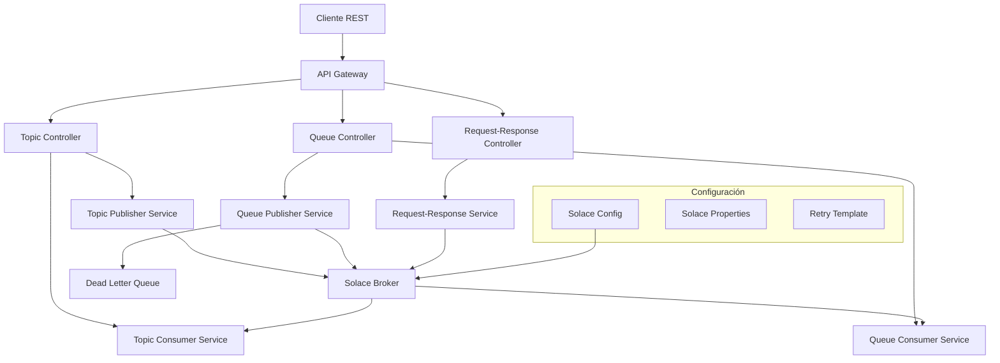
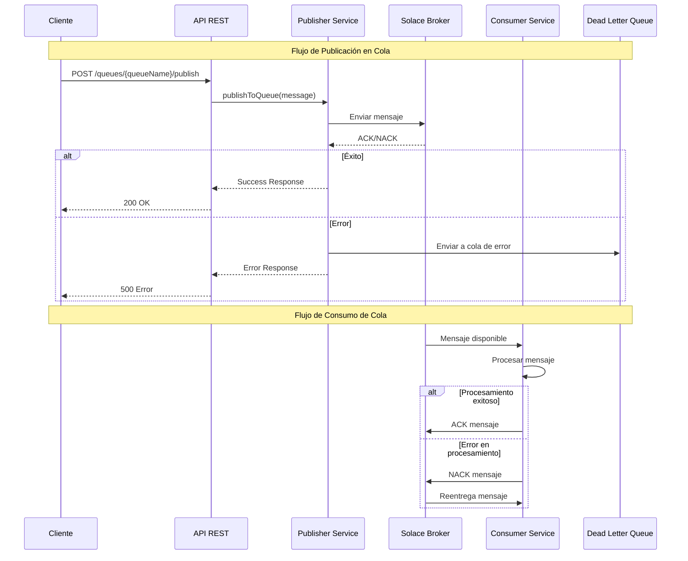
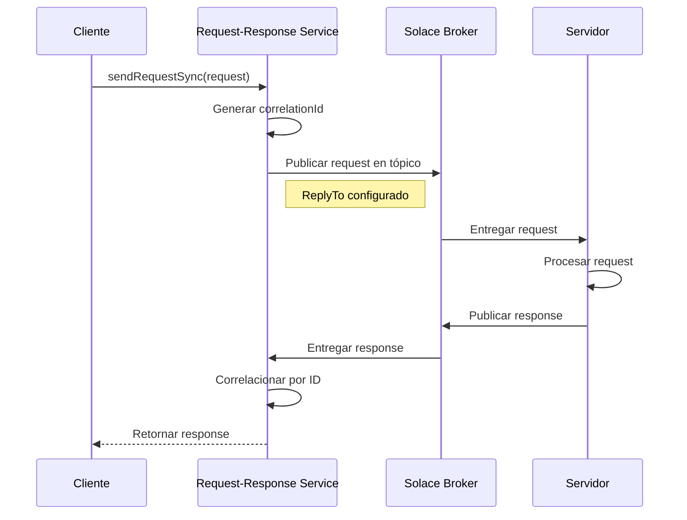
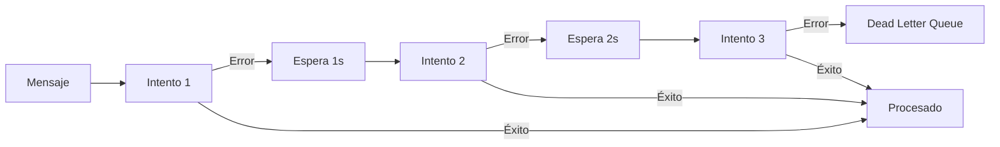

# Solace Client Archetype

## Descripción

**Solace Client Archetype** es un microservicio Spring Boot que proporciona una integración completa con el broker de mensajería Solace. Este proyecto implementa las mejores prácticas para el manejo de mensajería empresarial, incluyendo patrones de publicación/suscripción, colas de mensajes, y comunicación request-response.

## Características Principales

- ✅ **Publicación en Tópicos**: Envío de mensajes a tópicos de Solace
- ✅ **Publicación en Colas**: Envío de mensajes a colas de Solace con persistencia
- ✅ **Consumo de Tópicos**: Suscripción y procesamiento de mensajes de tópicos
- ✅ **Consumo de Colas**: Procesamiento de mensajes de colas con acknowledgment
- ✅ **Request-Response**: Patrón de comunicación síncrona y asíncrona
- ✅ **Manejo de Errores**: Reintentos automáticos y colas de error (Dead Letter Queue)
- ✅ **API RESTful**: Interfaz HTTP para todas las operaciones de mensajería
- ✅ **Configuración Externa**: Configuración flexible a través de archivos YAML
- ✅ **Documentación OpenAPI**: Documentación automática de las APIs
- ✅ **Monitoreo**: Endpoints de salud y métricas con Actuator

## Arquitectura

### Diagrama de Arquitectura General



### Diagrama de Flujo de Mensajes



### Diagrama de Request-Response



## Estructura del Proyecto

```
src/
├── main/
│   ├── java/com/solace/client/archetype/
│   │   ├── config/                 # Configuración
│   │   │   ├── SolaceConfig.java
│   │   │   ├── SolaceProperties.java
│   │   │   └── JacksonConfig.java
│   │   ├── controller/             # Controladores REST
│   │   │   ├── TopicController.java
│   │   │   ├── QueueController.java
│   │   │   └── RequestResponseController.java
│   │   ├── service/                # Servicios de negocio
│   │   │   ├── TopicPublisherService.java
│   │   │   ├── TopicConsumerService.java
│   │   │   ├── QueuePublisherService.java
│   │   │   ├── QueueConsumerService.java
│   │   │   └── RequestResponseService.java
│   │   ├── model/                  # Modelos de datos
│   │   │   ├── SolaceMessage.java
│   │   │   └── MessageResponse.java
│   │   ├── exception/              # Manejo de excepciones
│   │   │   └── GlobalExceptionHandler.java
│   │   └── SolaceClientArchetypeApplication.java
│   └── resources/
│       └── application.yml         # Configuración de la aplicación
└── test/                          # Pruebas unitarias
```

## Configuración

### Variables de Entorno

| Variable | Descripción | Valor por Defecto |
|----------|-------------|------------------|
| `SOLACE_HOST` | URL del broker Solace | `tcp://localhost:55555` |
| `SOLACE_VPN` | Nombre de la VPN | `default` |
| `SOLACE_USERNAME` | Usuario de conexión | `admin` |
| `SOLACE_PASSWORD` | Contraseña de conexión | `admin` |

### Archivo de Configuración

El archivo `application.yml` contiene toda la configuración del microservicio:

```yaml
# Configuración del servidor
server:
  port: 8080
  servlet:
    context-path: /api/v1

# Configuración de Solace
solace:
  client:
    broker:
      host: ${SOLACE_HOST:tcp://localhost:55555}
      vpn: ${SOLACE_VPN:default}
      username: ${SOLACE_USERNAME:admin}
      password: ${SOLACE_PASSWORD:admin}
    
    topics:
      notification: notifications/topic
      events: events/topic
      
    queues:
      orders: orders.queue
      notifications: notifications.queue
      dead-letter: dead.letter.queue
      
    retry:
      max-attempts: 3
      initial-delay-ms: 1000
      max-delay-ms: 10000
      multiplier: 2.0
```

## APIs Disponibles

### Endpoints de Tópicos

| Método | Endpoint | Descripción |
|--------|----------|-------------|
| POST | `/topics/{topicName}/publish` | Publicar mensaje en tópico específico |
| POST | `/topics/notifications/publish` | Publicar notificación |
| POST | `/topics/events/publish` | Publicar evento |
| POST | `/topics/{topicName}/subscribe` | Suscribirse a tópico |
| DELETE | `/topics/{topicName}/unsubscribe` | Desuscribirse de tópico |
| GET | `/topics/{topicName}/consumed` | Obtener mensajes consumidos |
| GET | `/topics/consumed/all` | Obtener todos los mensajes consumidos |
| DELETE | `/topics/{topicName}/consumed` | Limpiar mensajes consumidos |

### Endpoints de Colas

| Método | Endpoint | Descripción |
|--------|----------|-------------|
| POST | `/queues/{queueName}/publish` | Publicar mensaje en cola específica |
| POST | `/queues/orders/publish` | Publicar orden |
| POST | `/queues/notifications/publish` | Publicar notificación en cola |
| GET | `/queues/{queueName}/consumed` | Obtener mensajes consumidos de cola |
| GET | `/queues/consumed/all` | Obtener todos los mensajes consumidos |
| GET | `/queues/{queueName}/stats` | Obtener estadísticas de cola |
| DELETE | `/queues/{queueName}/consumed` | Limpiar mensajes consumidos |

### Endpoints de Request-Response

| Método | Endpoint | Descripción |
|--------|----------|-------------|
| POST | `/request-response/send-async` | Enviar request asíncrono |
| POST | `/request-response/send-sync` | Enviar request síncrono |
| POST | `/request-response/start-server/{topicName}` | Iniciar servidor de requests |
| GET | `/request-response/stats` | Obtener estadísticas |
| POST | `/request-response/test` | Endpoint de prueba |

## Ejemplos de Uso

### 1. Publicar Mensaje en Tópico

```bash
curl -X POST http://localhost:8080/api/v1/topics/my-topic/publish \
  -H "Content-Type: application/json" \
  -d '{
    "type": "NOTIFICATION",
    "payload": {
      "message": "Hello World",
      "priority": "HIGH"
    },
    "headers": {
      "source": "user-service",
      "version": "1.0"
    }
  }'
```

**Respuesta:**
```json
{
  "success": true,
  "message": "Mensaje publicado exitosamente en tópico",
  "messageId": "123e4567-e89b-12d3-a456-426614174000",
  "destination": "my-topic",
  "timestamp": "2023-10-15T10:30:00"
}
```

### 2. Publicar Orden en Cola

```bash
curl -X POST http://localhost:8080/api/v1/queues/orders/publish \
  -H "Content-Type: application/json" \
  -d '{
    "type": "ORDER",
    "payload": {
      "orderId": "ORD-001",
      "amount": 100.50,
      "currency": "EUR"
    }
  }'
```

### 3. Request-Response Síncrono

```bash
curl -X POST http://localhost:8080/api/v1/request-response/send-sync \
  -H "Content-Type: application/json" \
  -d '{
    "type": "QUERY",
    "payload": {
      "query": "SELECT * FROM users WHERE active = true"
    }
  }'
```

### 4. Obtener Mensajes Consumidos

```bash
curl -X GET http://localhost:8080/api/v1/topics/my-topic/consumed
```

## Manejo de Errores

### Estrategia de Reintentos

El microservicio implementa una estrategia de reintentos exponencial:



### Dead Letter Queue

Los mensajes que fallan después de todos los reintentos se envían automáticamente a una cola de error (Dead Letter Queue) para análisis posterior.

### Códigos de Error

| Código | Descripción |
|--------|-------------|
| 400 | Parámetros inválidos o mensaje malformado |
| 408 | Timeout en operación Request-Response |
| 500 | Error interno del sistema o broker no disponible |
| 503 | Servicio temporalmente no disponible |

## Instalación y Ejecución

### Requisitos

- Java 17 o superior
- Maven 3.6 o superior
- Broker Solace (local o remoto)

### Pasos de Instalación

1. **Clonar el repositorio:**
```bash
git clone https://github.com/leoromerbric/solace-client-archetype.git
cd solace-client-archetype
```

2. **Configurar variables de entorno:**
```bash
export SOLACE_HOST=tcp://your-solace-broker:55555
export SOLACE_VPN=your-vpn-name
export SOLACE_USERNAME=your-username
export SOLACE_PASSWORD=your-password
```

3. **Compilar el proyecto:**
```bash
mvn clean compile
```

4. **Ejecutar la aplicación:**
```bash
mvn spring-boot:run
```

5. **Verificar que está funcionando:**
```bash
curl http://localhost:8080/api/v1/actuator/health
```

### Ejecutar con Docker

```dockerfile
FROM openjdk:17-jdk-slim
COPY target/solace-client-archetype-1.0.0.jar app.jar
EXPOSE 8080
ENTRYPOINT ["java", "-jar", "/app.jar"]
```

```bash
mvn clean package
docker build -t solace-client-archetype .
docker run -p 8080:8080 \
  -e SOLACE_HOST=tcp://broker:55555 \
  -e SOLACE_VPN=default \
  -e SOLACE_USERNAME=admin \
  -e SOLACE_PASSWORD=admin \
  solace-client-archetype
```

## Monitoreo y Observabilidad

### Endpoints de Actuator

| Endpoint | Descripción |
|----------|-------------|
| `/actuator/health` | Estado de salud de la aplicación |
| `/actuator/metrics` | Métricas de la aplicación |
| `/actuator/info` | Información de la aplicación |
| `/actuator/prometheus` | Métricas en formato Prometheus |

### Métricas Disponibles

- **Conexiones Solace**: Estado de conexión con el broker
- **Mensajes Procesados**: Contadores de mensajes enviados y recibidos
- **Errores**: Contadores de errores por tipo
- **Latencia**: Tiempo de procesamiento de mensajes
- **Requests Pendientes**: Número de requests sin respuesta

### Logs

Los logs se configuran automáticamente con diferentes niveles:

- **INFO**: Operaciones normales
- **WARN**: Advertencias y errores recuperables
- **ERROR**: Errores críticos
- **DEBUG**: Información detallada para desarrollo

## Documentación de API

### Swagger UI

Una vez que la aplicación esté ejecutándose, la documentación interactiva de la API estará disponible en:

**URL**: `http://localhost:8080/api/v1/swagger-ui/index.html`

### OpenAPI Specification

La especificación OpenAPI está disponible en:

**URL**: `http://localhost:8080/api/v1/v3/api-docs`

## Mejores Prácticas Implementadas

### 1. Configuración
- ✅ Externalización de configuración
- ✅ Profiles de Spring para diferentes entornos
- ✅ Validación de configuración al inicio

### 2. Manejo de Errores
- ✅ Reintentos exponenciales
- ✅ Circuit breaker pattern
- ✅ Dead Letter Queue para mensajes fallidos
- ✅ Logging estructurado de errores

### 3. Rendimiento
- ✅ Pool de conexiones configurables
- ✅ Procesamiento asíncrono
- ✅ Acknowledgment manual para control de flujo
- ✅ Timeouts configurables

### 4. Seguridad
- ✅ Validación de entrada
- ✅ Manejo seguro de credenciales
- ✅ Logs sin información sensible

### 5. Observabilidad
- ✅ Métricas de negocio y técnicas
- ✅ Health checks
- ✅ Distributed tracing ready
- ✅ Logs estructurados

## Solución de Problemas

### Problemas Comunes

1. **Error de Conexión con Solace**
   ```
   Verificar la configuración de conexión en application.yml
   Verificar que el broker Solace esté accesible
   Verificar credenciales de autenticación
   ```

2. **Mensajes no se Procesan**
   ```
   Verificar que las colas estén configuradas en Solace
   Verificar permisos de las colas
   Revisar logs para errores de deserialización
   ```

3. **Timeout en Request-Response**
   ```
   Verificar que hay un servidor procesando requests
   Aumentar el timeout en la configuración
   Verificar la configuración del tópico de response
   ```

### Comandos de Diagnóstico

```bash
# Verificar salud de la aplicación
curl http://localhost:8080/api/v1/actuator/health

# Verificar métricas
curl http://localhost:8080/api/v1/actuator/metrics

# Ver estadísticas de Request-Response
curl http://localhost:8080/api/v1/request-response/stats

# Ver mensajes consumidos
curl http://localhost:8080/api/v1/topics/consumed/all
```

## Contribución

### Cómo Contribuir

1. Fork del repositorio
2. Crear una rama para la funcionalidad: `git checkout -b feature/nueva-funcionalidad`
3. Commit de los cambios: `git commit -am 'Agregar nueva funcionalidad'`
4. Push a la rama: `git push origin feature/nueva-funcionalidad`
5. Crear un Pull Request

### Estándares de Código

- Seguir las convenciones de Java
- Documentar todas las clases y métodos públicos
- Escribir pruebas unitarias para nueva funcionalidad
- Mantener cobertura de código superior al 80%

## Licencia

Este proyecto está licenciado bajo la Licencia MIT - ver el archivo [LICENSE](LICENSE) para más detalles.

## Soporte

Para soporte técnico o preguntas sobre el proyecto:

- **Issues**: [GitHub Issues](https://github.com/leoromerbric/solace-client-archetype/issues)
- **Wiki**: [Documentación Técnica](https://github.com/leoromerbric/solace-client-archetype/wiki)
- **Discusiones**: [GitHub Discussions](https://github.com/leoromerbric/solace-client-archetype/discussions)

---

**Versión**: 1.0.0  
**Última Actualización**: Diciembre 2024  
**Autor**: Solace Client Archetype Team