# Arquitectura de la Solución - Solace Client Archetype

## Resumen Ejecutivo

El **Solace Client Archetype** es un microservicio Spring Boot diseñado para proporcionar una integración completa y robusta con el broker de mensajería Solace. La arquitectura implementa patrones empresariales de mensajería, incluyendo publicación/suscripción, colas de mensajes, y comunicación request-response.

## Arquitectura General del Sistema

### Vista de Alto Nivel

```mermaid
graph TB
    subgraph "Cliente Externo"
        Client[Cliente REST/HTTP]
        PostmanClient[Cliente Postman]
        WebClient[Cliente Web]
    end

    subgraph "Capa de Presentación"
        Gateway[API Gateway/Load Balancer]
    end

    subgraph "Microservicio Solace Client Archetype"
        subgraph "Controladores REST"
            TopicController[Topic Controller]
            QueueController[Queue Controller] 
            RequestResponseController[Request-Response Controller]
            ActuatorEndpoints[Actuator Endpoints]
        end

        subgraph "Capa de Servicios"
            TopicPublisher[Topic Publisher Service]
            TopicConsumer[Topic Consumer Service]
            QueuePublisher[Queue Publisher Service]
            QueueConsumer[Queue Consumer Service]
            RequestResponse[Request-Response Service]
        end

        subgraph "Capa de Configuración"
            SolaceConfig[Solace Configuration]
            SolaceProperties[Solace Properties]
            RetryTemplate[Retry Template]
            ExceptionHandler[Global Exception Handler]
        end

        subgraph "Modelos de Datos"
            SolaceMessage[Solace Message Model]
            MessageResponse[Message Response Model]
        end
    end

    subgraph "Infraestructura de Mensajería"
        SolaceBroker[Solace PubSub+ Broker]
        DeadLetterQueue[Dead Letter Queue]
        Topics[Topics/Exchanges]
        Queues[Queues]
    end

    subgraph "Monitoreo y Observabilidad"
        Actuator[Spring Actuator]
        SwaggerUI[Swagger UI]
        Logs[Application Logs]
    end

    %% Conexiones Cliente -> API
    Client --> Gateway
    PostmanClient --> Gateway
    WebClient --> Gateway

    %% Conexiones Gateway -> Controladores
    Gateway --> TopicController
    Gateway --> QueueController
    Gateway --> RequestResponseController
    Gateway --> ActuatorEndpoints

    %% Conexiones Controladores -> Servicios
    TopicController --> TopicPublisher
    TopicController --> TopicConsumer
    QueueController --> QueuePublisher
    QueueController --> QueueConsumer
    RequestResponseController --> RequestResponse

    %% Conexiones Servicios -> Broker
    TopicPublisher --> SolaceBroker
    QueuePublisher --> SolaceBroker
    RequestResponse --> SolaceBroker

    %% Conexiones Broker -> Consumidores
    SolaceBroker --> TopicConsumer
    SolaceBroker --> QueueConsumer

    %% Conexiones de configuración
    SolaceConfig --> SolaceBroker
    SolaceProperties --> SolaceConfig
    RetryTemplate --> QueuePublisher
    RetryTemplate --> TopicPublisher

    %% Manejo de errores
    QueuePublisher --> DeadLetterQueue
    ExceptionHandler --> QueuePublisher
    ExceptionHandler --> TopicPublisher

    %% Infraestructura Solace
    SolaceBroker --> Topics
    SolaceBroker --> Queues
    SolaceBroker --> DeadLetterQueue

    %% Monitoreo
    ActuatorEndpoints --> Actuator
    ActuatorEndpoints --> SwaggerUI
    TopicPublisher --> Logs
    QueuePublisher --> Logs
    RequestResponse --> Logs

    %% Estilos
    classDef clientClass fill:#e1f5fe
    classDef controllerClass fill:#f3e5f5
    classDef serviceClass fill:#e8f5e8
    classDef configClass fill:#fff3e0
    classDef infraClass fill:#ffebee
    classDef monitorClass fill:#f1f8e9

    class Client,PostmanClient,WebClient clientClass
    class TopicController,QueueController,RequestResponseController,ActuatorEndpoints controllerClass
    class TopicPublisher,TopicConsumer,QueuePublisher,QueueConsumer,RequestResponse serviceClass
    class SolaceConfig,SolaceProperties,RetryTemplate,ExceptionHandler configClass
    class SolaceBroker,DeadLetterQueue,Topics,Queues infraClass
    class Actuator,SwaggerUI,Logs monitorClass
```



## Componentes Principales

### 1. Capa de Controladores REST

#### Topic Controller
- **Propósito**: Gestiona las operaciones de publicación y suscripción a tópicos
- **Endpoints principales**:
  - `POST /topics/{topicName}/publish` - Publicar mensaje
  - `POST /topics/{topicName}/subscribe` - Suscribirse a tópico
  - `GET /topics/{topicName}/consumed` - Obtener mensajes consumidos

#### Queue Controller
- **Propósito**: Gestiona las operaciones de colas de mensajes
- **Endpoints principales**:
  - `POST /queues/{queueName}/publish` - Publicar a cola
  - `GET /queues/{queueName}/consumed` - Obtener mensajes consumidos
  - `GET /queues/{queueName}/stats` - Estadísticas de cola

#### Request-Response Controller
- **Propósito**: Implementa el patrón de comunicación request-response
- **Endpoints principales**:
  - `POST /request-response/test` - Test de request-response

### 2. Capa de Servicios

#### Topic Publisher Service
- **Responsabilidades**:
  - Publicación de mensajes en tópicos de Solace
  - Manejo de reconocimientos (ACK/NACK)
  - Logging y métricas de publicación

#### Topic Consumer Service
- **Responsabilidades**:
  - Suscripción automática a tópicos configurados
  - Procesamiento de mensajes recibidos
  - Almacenamiento temporal de mensajes consumidos

#### Queue Publisher Service
- **Responsabilidades**:
  - Publicación de mensajes en colas persistentes
  - Manejo de reintentos con backoff exponencial
  - Envío a Dead Letter Queue en caso de fallos

#### Queue Consumer Service
- **Responsabilidades**:
  - Consumo de mensajes de colas
  - Procesamiento con acknowledgment manual
  - Manejo de reentregas

#### Request-Response Service
- **Responsabilidades**:
  - Implementación de comunicación síncrona
  - Correlación de mensajes por ID
  - Manejo de timeouts

### 3. Capa de Configuración

#### Solace Configuration
```java
@Configuration
public class SolaceConfig {
    // Configuración de sesión JCSMP
    // Configuración de productores y consumidores
    // Configuración de endpoints
}
```

#### Solace Properties
```yaml
solace:
  client:
    broker:
      host: tcp://localhost:55555
      vpn: default
      username: solace-client
      password: password
    topics:
      notifications: solace/notifications
      events: solace/events
    queues:
      orders: solace.queue.orders
      notifications: solace.queue.notifications
      dead-letter: solace.queue.deadletter
```

## Patrones de Arquitectura Implementados

### 1. Publisher-Subscriber Pattern
- **Implementación**: A través de tópicos de Solace
- **Uso**: Notificaciones y eventos del sistema
- **Características**: Desacoplamiento temporal y espacial

### 2. Point-to-Point Messaging
- **Implementación**: A través de colas de Solace
- **Uso**: Procesamiento de órdenes y tareas críticas
- **Características**: Garantía de entrega y procesamiento único

### 3. Request-Response Pattern
- **Implementación**: Correlation ID y ReplyTo topics
- **Uso**: Comunicación síncrona cuando se requiere respuesta
- **Características**: Timeout configurable y correlación de mensajes

### 4. Dead Letter Queue Pattern
- **Implementación**: Cola de error automática
- **Uso**: Mensajes que fallan después de reintentos
- **Características**: Preservación de mensajes para análisis

### 5. Circuit Breaker Pattern
- **Implementación**: Spring Retry con backoff exponencial
- **Uso**: Protección contra fallos del broker
- **Características**: Reintentos inteligentes y degradación graceful

## Flujo de Datos

### Publicación en Tópicos
1. Cliente HTTP envía mensaje a endpoint REST
2. Topic Controller valida y procesa la petición
3. Topic Publisher Service formatea el mensaje
4. Mensaje se publica en el tópico de Solace
5. Topic Consumer Service recibe y procesa el mensaje
6. Respuesta HTTP se envía al cliente

### Publicación en Colas
1. Cliente HTTP envía mensaje a endpoint de cola
2. Queue Controller procesa la petición
3. Queue Publisher Service publica con reintentos
4. En caso de fallo, mensaje va a Dead Letter Queue
5. Queue Consumer Service procesa mensajes exitosos
6. ACK/NACK se envía según resultado del procesamiento

### Request-Response
1. Cliente envía request a endpoint request-response
2. Request-Response Service genera correlation ID
3. Request se publica con ReplyTo configurado
4. Servicio espera respuesta correlacionada
5. Respuesta se retorna al cliente HTTP

## Características de Calidad

### Confiabilidad
- Mensajes persistentes en colas
- Dead Letter Queue para manejo de errores
- Reintentos exponenciales
- Acknowledgment manual de mensajes

### Escalabilidad
- Consumidores concurrentes configurables
- Pools de conexiones optimizados
- Procesamiento asíncrono de mensajes

### Observabilidad
- Logging estructurado
- Métricas con Spring Actuator
- Health checks automáticos
- Documentación OpenAPI

### Seguridad
- Autenticación con Solace broker
- Validación de mensajes de entrada
- Manejo seguro de excepciones

## Tecnologías Utilizadas

- **Framework**: Spring Boot 3.3.5
- **Mensajería**: Solace PubSub+ (JCSMP 10.15.0)
- **Documentación**: OpenAPI 3 / Swagger
- **Monitoreo**: Spring Boot Actuator
- **Serialización**: Jackson JSON
- **Testing**: JUnit 5, Mockito
- **Build**: Maven 3.6+
- **Java**: JDK 17+