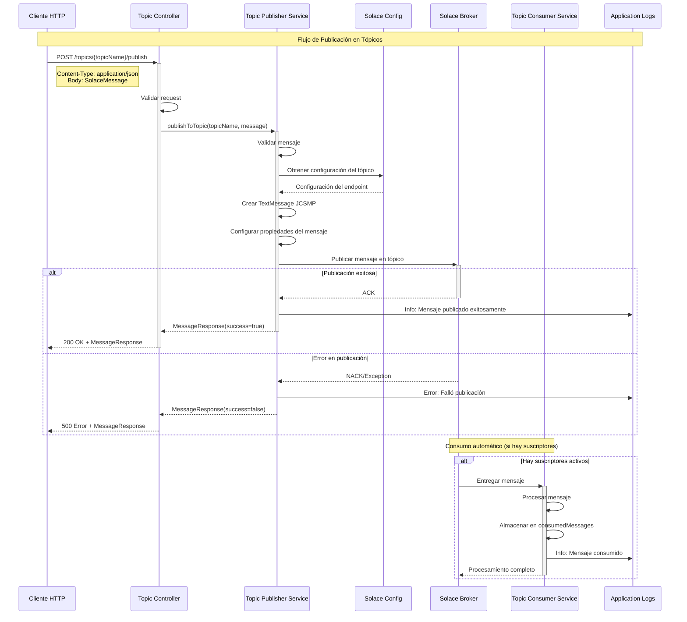
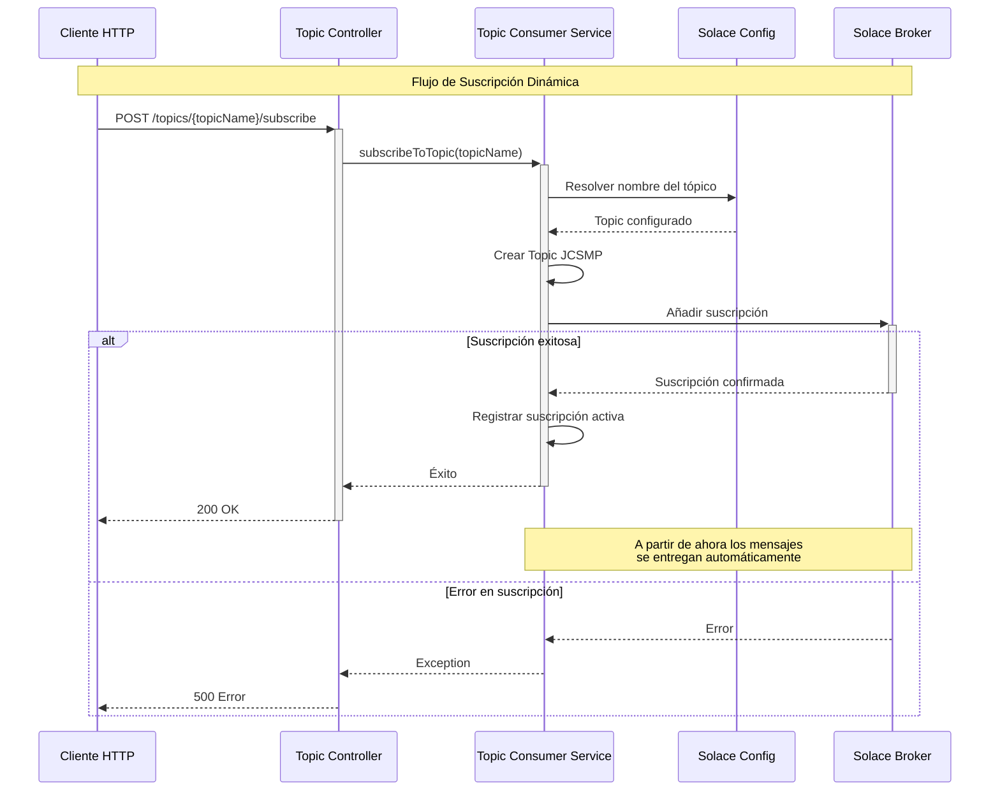
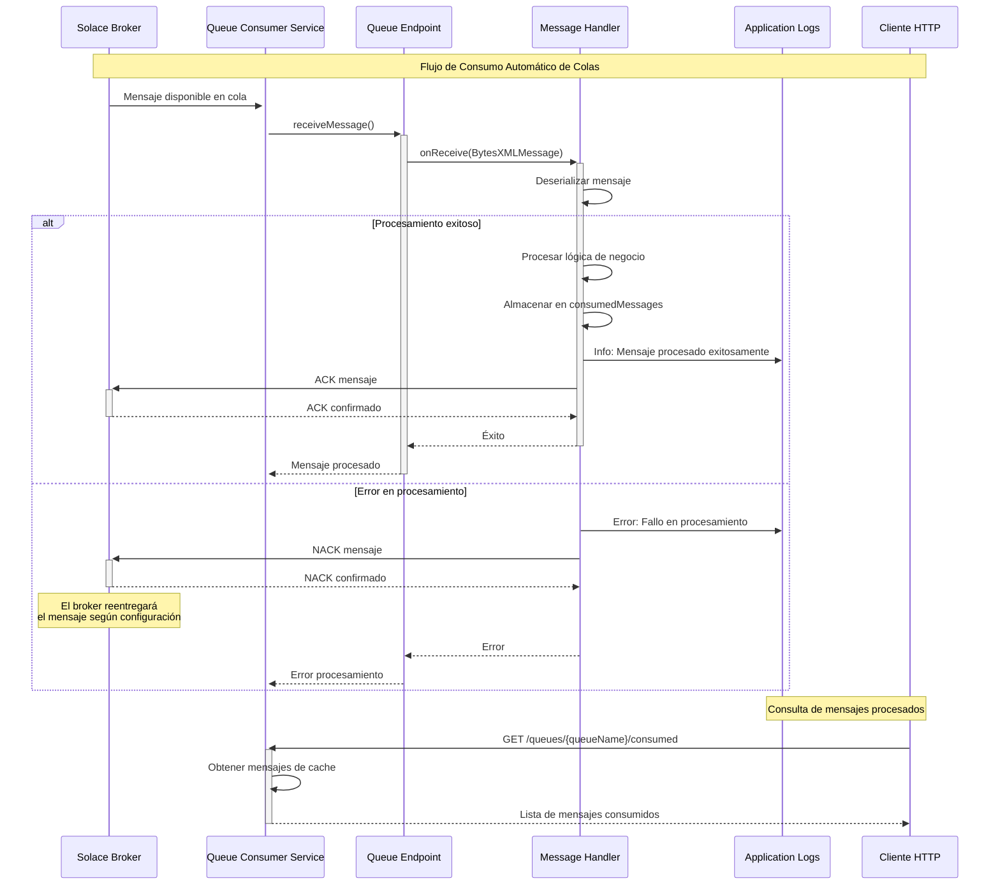
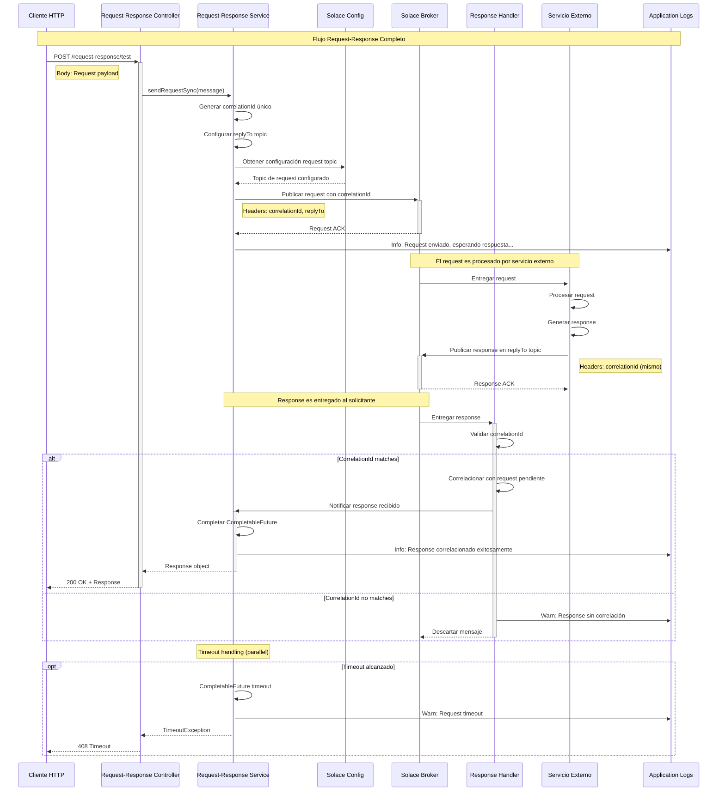
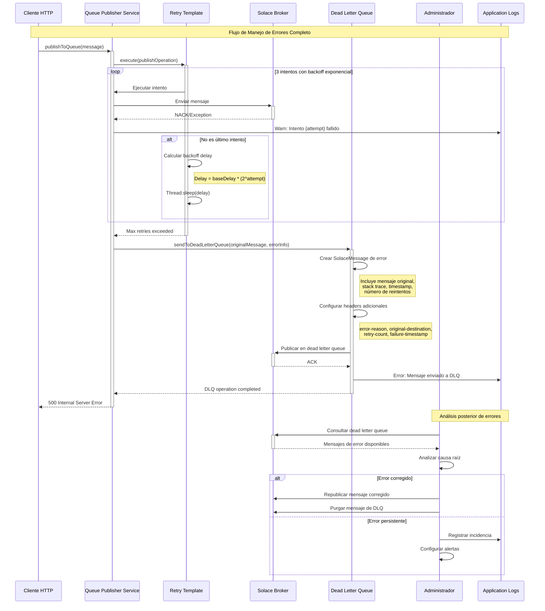
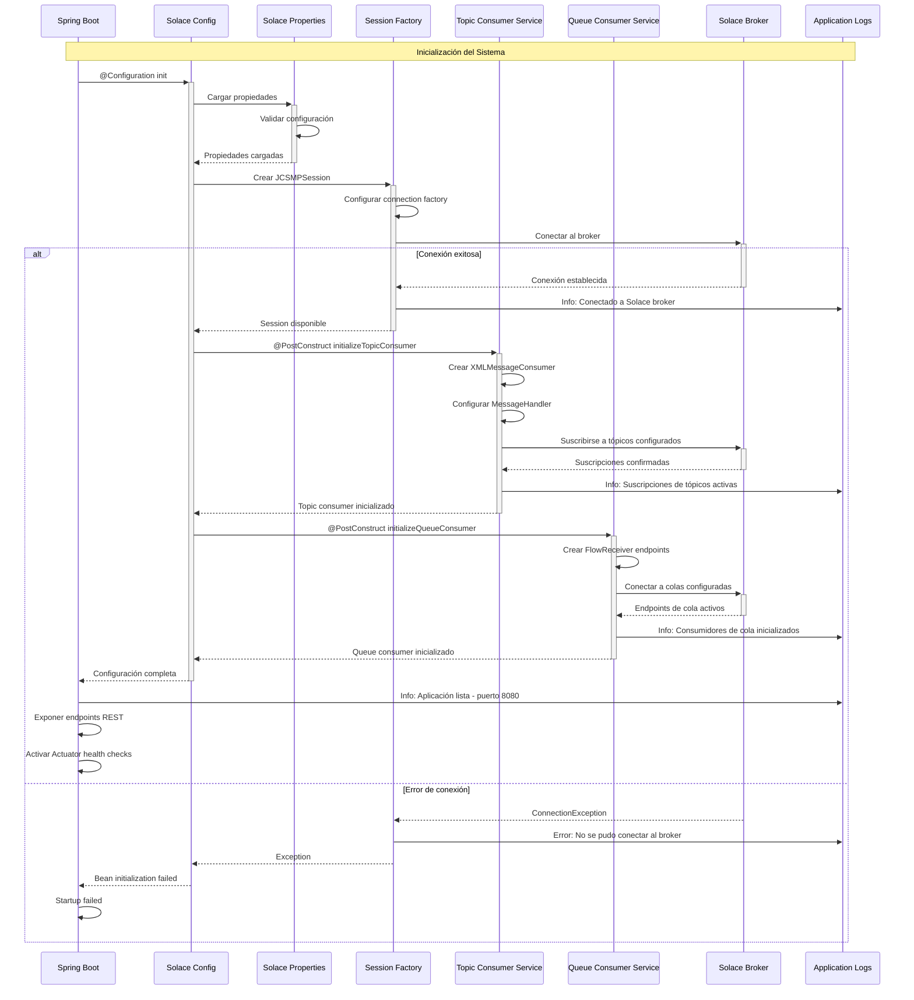
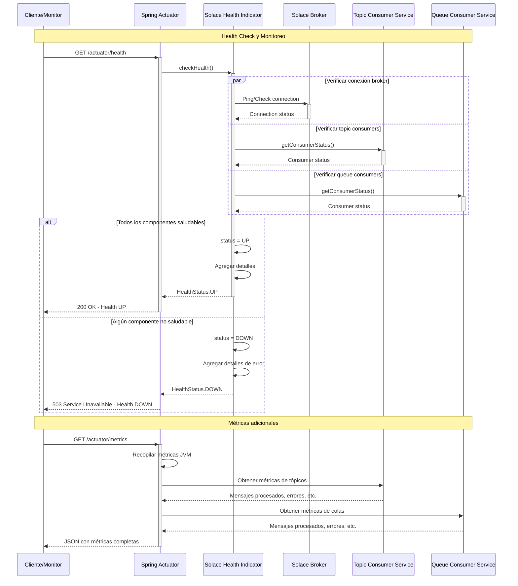

# Diagramas de Secuencia - Solace Client Archetype

## Introducción

Este documento contiene los diagramas de secuencia detallados que muestran el funcionamiento interno del sistema Solace Client Archetype. Los diagramas ilustran los flujos de mensajería para todos los patrones implementados.

---

## 1. Flujo de Publicación en Tópicos

### Escenario: Cliente publica mensaje en un tópico



---

## 2. Flujo de Suscripción a Tópicos

### Escenario: Cliente se suscribe dinámicamente a un tópico



---

## 3. Flujo de Publicación en Colas con Reintentos

### Escenario: Cliente publica mensaje en cola con posibles fallos

```mermaid
sequenceDiagram
    participant Client as Cliente HTTP
    participant QC as Queue Controller
    participant QPS as Queue Publisher Service
    participant RT as Retry Template
    participant SC as Solace Config
    participant SB as Solace Broker
    participant DLQ as Dead Letter Queue
    participant Log as Application Logs

    Note over Client,Log: Flujo de Publicación en Colas con Reintentos

    Client->>+QC: POST /queues/{queueName}/publish
    QC->>QC: Validar request
    QC->>+QPS: publishToQueue(queueName, message)

    QPS->>SC: Obtener configuración de cola
    SC-->>QPS: Queue endpoint

    QPS->>+RT: execute(publishOperation)
    
    loop Hasta 3 intentos máximo
        RT->>+QPS: Ejecutar intento
        QPS->>QPS: Crear mensaje persistente
        QPS->>+SB: Enviar mensaje a cola
        
        alt Intento exitoso
            SB-->>-QPS: ACK
            QPS->>Log: Info: Mensaje enviado exitosamente
            QPS-->>-RT: Éxito
            RT-->>-QPS: Operación completada
            QPS-->>-QC: MessageResponse(success=true)
            QC-->>-Client: 200 OK
        else Fallo temporal
            SB-->>QPS: NACK/Timeout
            QPS->>Log: Warn: Intento fallido, reintentando...
            QPS-->>RT: Exception
            RT->>RT: Esperar backoff exponencial
            Note right of RT: Backoff: 1s, 2s, 4s
        end
    end
    
    alt Todos los intentos fallaron
        RT-->>QPS: Max retries exceeded
        QPS->>+DLQ: sendToDeadLetterQueue(message, error)
        DLQ->>DLQ: Crear mensaje de error
        DLQ->>SB: Enviar a cola de error
        SB-->>-DLQ: ACK
        QPS->>Log: Error: Mensaje enviado a DLQ
        QPS-->>QC: MessageResponse(success=false)
        QC-->>Client: 500 Error
    end
```

---

## 4. Flujo de Consumo de Colas

### Escenario: Consumo automático de mensajes de cola



---

## 5. Flujo Request-Response Completo

### Escenario: Comunicación request-response con correlation ID



---

## 6. Flujo de Manejo de Errores y Dead Letter Queue

### Escenario: Mensaje falla y es enviado a Dead Letter Queue



---

## 7. Flujo de Inicialización del Sistema

### Escenario: Startup y configuración de componentes



---

## 8. Flujo de Health Check y Monitoreo

### Escenario: Verificación del estado del sistema



---

## Conclusión

Estos diagramas de secuencia proporcionan una visión detallada del funcionamiento interno del sistema Solace Client Archetype, mostrando:

- **Flujos de publicación/suscripción** en tópicos y colas
- **Manejo robusto de errores** con reintentos y Dead Letter Queue
- **Patrones request-response** con correlación de mensajes
- **Inicialización correcta** del sistema y sus componentes
- **Monitoreo y observabilidad** del estado de salud

Cada flujo está diseñado para ser resiliente, observable y fácil de troubleshoot en producción.